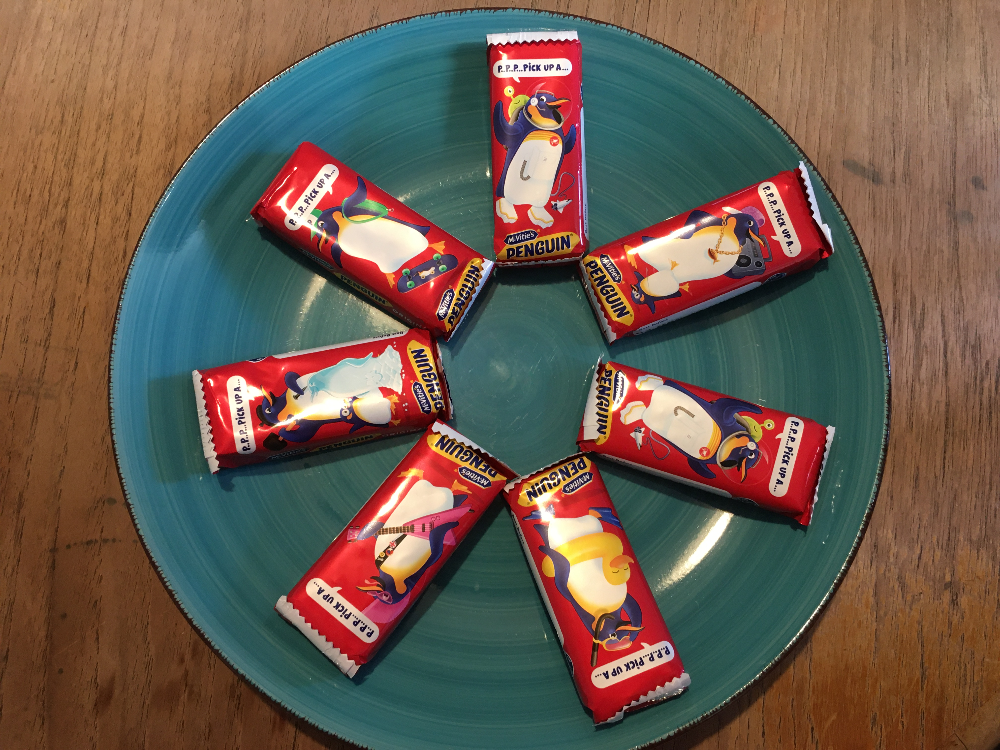

<head>

</head>

<body>

<section id="image-carousel" class="splide" aria-label="Biscuit Images">
  

		<ul class="splide__list">
			<li class="splide__slide">
				
			</li>
			<li class="splide__slide">
				
			</li>
			<li class="splide__slide">
				
			</li>
		</ul>
  

.splide__slide img {
  width: 100%;
  height: auto;
}

</section>

</body>

